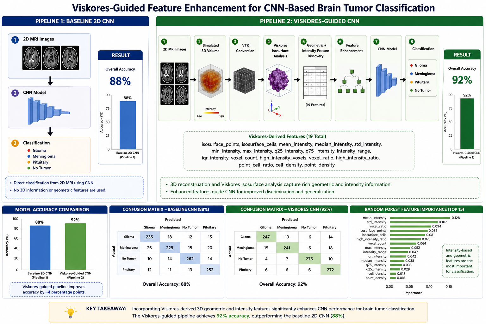

# Viskores-Guided CNN Brain Tumor Classification

This project investigates whether Viskores-guided geometric and intensity feature discovery can improve CNN-based brain tumor classification.

## Pipeline 1: Baseline CNN

2D MRI Images
→ CNN
→ Classification

Accuracy: 88%

---

## Pipeline 2: Viskores-Guided CNN

2D MRI Images
→ Simulated 3D Volume
→ VTK Conversion
→ Viskores Isosurface Analysis
→ Geometric + Intensity Feature Discovery
→ Feature Enhancement
→ CNN
→ Classification

Accuracy: 92%

---

## Workflow

---
The proposed Viskores-Guided CNN pipeline leverages scientific visualization and geometric analysis to enhance brain tumor classification. Starting from 2D MRI slices, a simulated 3D volume is reconstructed and converted into VTK format for processing with Viskores. Viskores extracts an isosurface representation of the tumor, generating a 3D mesh composed of vertices and connected triangular cells. This geometric representation enables visualization-driven feature discovery, revealing structural patterns that are difficult to observe directly in the original MRI images. Quantitative descriptors such as mesh complexity, surface geometry, point and cell counts, volumetric properties, and intensity statistics are then computed. These features provide interpretable insights into tumor morphology and heterogeneity, supporting a deeper understanding of the underlying data. The extracted information is used to enhance the feature space provided to a CNN, which ultimately performs classification of MRI scans into glioma, meningioma, pituitary tumor, or no-tumor categories. This integration of Viskores-based visualization and deep learning improves both interpretability and predictive performance.

## Dataset

Brain Tumor MRI Dataset

Classes:

- Glioma
- Meningioma
- Pituitary
- No Tumor

---

## Technologies

- Python
- TensorFlow / Keras
- VTK
- Viskores
- NumPy
- Pandas
- Scikit-Learn
- Matplotlib

---

## Author

Dr. Suzan Anwar
Philander Smith University
